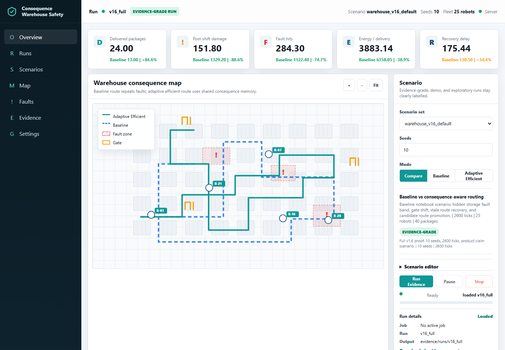
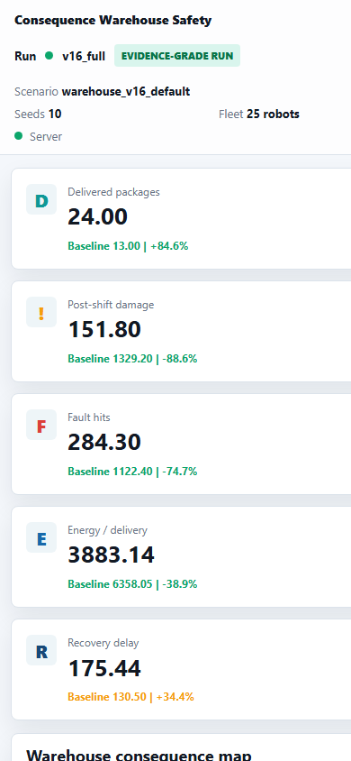

# Interface Screenshots

This proof kit includes public-safe operator dashboard images. They show the
proof surface without publishing private dashboard source code or engine code.

## Live Dashboard Capture

Desktop:

Mobile:

## Concept Image

## What The Interface Shows

- warehouse safety operating surface
- scenario and run context
- proof-oriented metrics
- evidence handoff direction
- dashboard direction for private engine review
- desktop and mobile layout direction

## What The Interface Does Not Include

- private dashboard source code
- private simulation engine code
- private generated run folders
- customer data
- commercial deployment tooling
